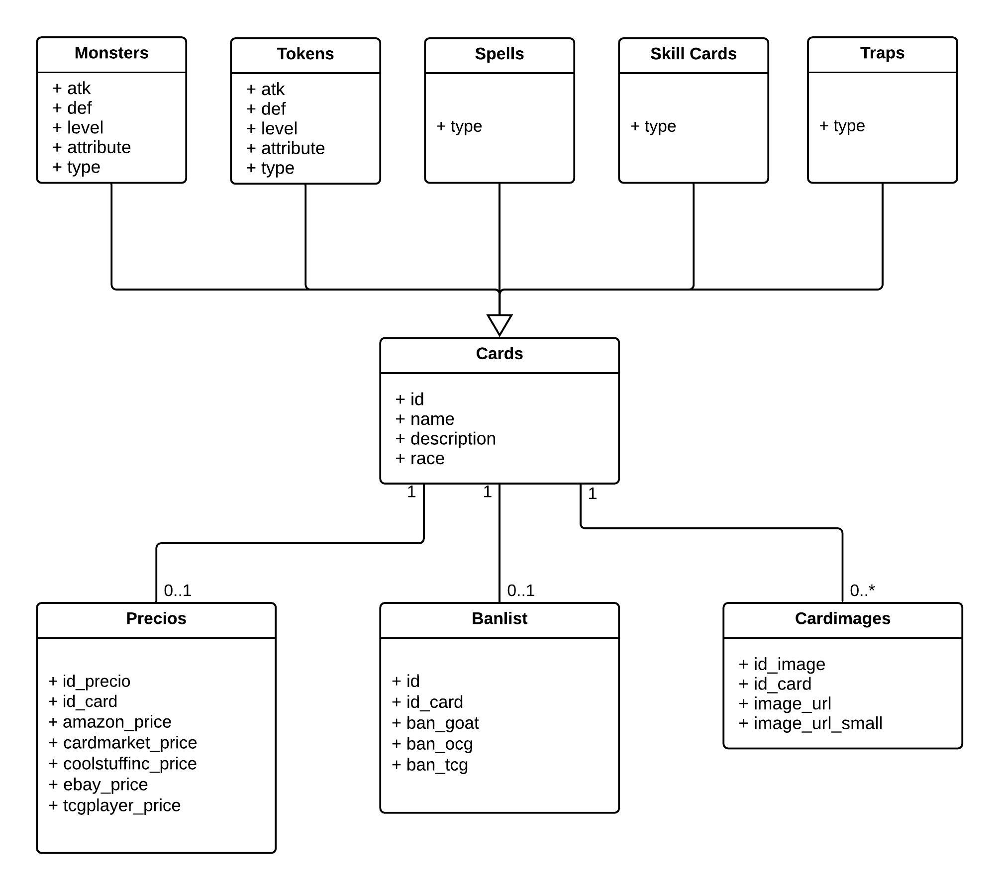

# CardGameAPIexample
## Logical Model


## API Doc

#### URL: /api/v1/Card
* Request Method: GET
* Request Params
* Error response 404 NOT FOUND

  | Request Params | Type    | Required |
  |----------------|---------|----------|
  | id             | Integer | True     |

- This endpoint return a card by id
  
#### URL: /api/v1/Cards
* Request Method: GET
* Request Params

  | Request Params | Type    | Required |
  |----------------|---------|----------|
  | atk            | Integer | False    |
  | def            | Integer | False    |
  | level          | Integer | False    |
  | type           | String  | False    |
  | race           | String  | False    |

- This endpoint returns a list, if no params are provided, return all results.

#### URL: /api/v1/CardsPage
* Request Method: GET
* Request Params

  | Request Params | Type    | Required | Default Value |
  |----------------|---------|----------|---------------|
  | atk            | Integer | False    | null          |
  | def            | Integer | False    | null          |
  | level          | Integer | False    | null          |
  | type           | String  | False    | null          |
  | race           | String  | False    | null          |
  | page           | Integer | False    | 0             |
  | size           | Integer | False    | 10            |

- This endpoint returns a Page, if no params are provided, return all results first page by default.

## Example

* URL: /api/v1/Card?id=23899727

* Response
```json
{
    "id": 23899727,
    "name": "Mermail Abysslinde",
    "desc": "If this card on the field is destroyed and sent to the Graveyard: You can Special Summon 1 \"Mermail\" monster from your Deck, except \"Mermail Abysslinde\". You can only use the effect of \"Mermail Abysslinde\" once per turn.",
    "race": "Aqua",
    "atk": 1500,
    "def": 1200,
    "level": 3,
    "attribute": "WATER",
    "type": "Effect Monster",
    "card_images": [
        {
            "id": 23899727,
            "image_url": ".../image/23899727.jpg",
        }
    ]
}
```
